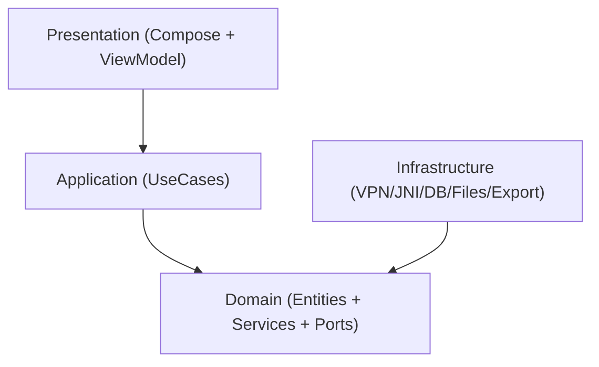
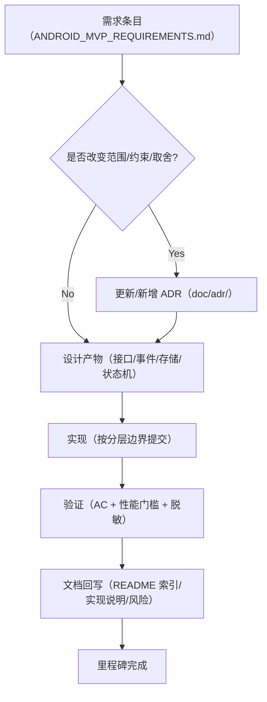
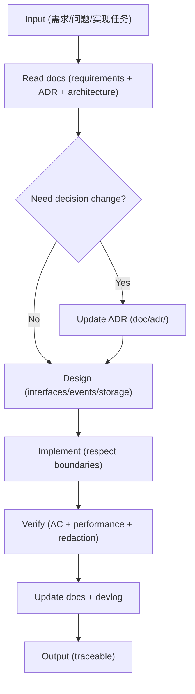

# AGENTS.md（开发代理工作约定）

本文件用于给人类开发者与 AI 代理提供**长期有效**的工程上下文与工作约束，确保实现与文档、架构决策一致，并在安全/性能/可维护性上满足抓包类产品的最佳实践。

## 工程现状（2026-02-13）

- 当前仓库以**文档与 Android 代码骨架**为主，尚未初始化完整 Android Gradle 工程。
- 已沉淀的基线文档位于 `doc/`（见 `doc/README.md`）。
- Android 分层骨架位于 `android/`（见 `android/README.md`）。

## 事实来源（Source of Truth）

任何需求/决策/边界以文档为准：
- **需求**：`doc/ANDROID_MVP_REQUIREMENTS.md`
- **技术栈**：`doc/TECH_STACK.md`
- **关键决策（ADR）**：`doc/adr/ADR-0001-mvp-decisions.md`
- **架构**：`doc/ARCHITECTURE.md`
- **事件协议**：`doc/EVENT_PROTOCOL.md`
- **实施计划**：`doc/MVP_IMPLEMENTATION_PLAN.md`

> 规则：当你的实现会改变“范围、约束或取舍”时，必须先更新 ADR 或相应文档，再写代码。

## MVP 目标与硬约束

- **最低支持**：Android 8.0（API 26 / `minSdk=26`）
- **抓包方式**：非 Root，`VpnService` + TUN
- **抓包内核**：SunnyNet（Android Tun(VPN) 驱动）
- **接入方式**：JNI `.so` **同进程直连**
- **协议范围（MVP）**：HTTP / HTTPS（尽可能明文）/ WebSocket
- **安全默认值**：默认脱敏；导出 HAR 默认脱敏
- **性能策略**：有界队列 + 背压 + 批处理落盘 + Body 分离存储

## 分层与边界（必须遵守）

- **Domain** 不得依赖 Android SDK、JNI、Room、网络库等基础设施实现。
- **Infrastructure** 只实现端口（Ports），不得把平台细节泄漏到 Domain。
- **Application** 只做编排（orchestration），不写平台细节。

## 代码风格与命名

- **语言**：Kotlin 优先；命名使用**清晰的英文语义**（类/函数/变量/包名）。
- **注释语言**：
  - 标准库/常见框架的直白用法：English comments（可省略）
  - 复杂业务/并发/一致性/性能权衡：中文注释（解释“为什么”）
- **错误处理**：
  - 不吞异常；返回 `Result` 或抛出有语义的异常；写清楚失败原因（用于 UI 提示与日志）。
  - JNI/Native 边界必须做输入校验与失败兜底（best-effort）。

## 抓包类产品的安全与合规要求（默认强制）

- **禁止**在文档/日志/导出中明文保留敏感信息（默认脱敏策略见领域 `Redactor` 设计）。
- **HTTPS 解密**必须提供清晰风险提示与用户确认，不承诺“解密所有 App”（pinning 例外）。
- **不要**实现或承诺绕过证书锁定（pinning）的能力（除非明确的授权安全测试范围，并记录到 ADR）。

## 性能与稳定性（MVP 质量门槛）

- **回调不可阻塞**：JNI 回调线程只做轻量封装，事件进入有界队列。
- **背压必须存在**：队列满时优先丢弃低价值事件；UI 显示“已降采样/已截断”提示。
- **Body 分离**：大 body 不直接入 DB；DB 只存索引与 `BodyRef`；文件生命周期要随清理策略一起管理。
- **长期运行**：以 30 分钟中等强度流量为基准，避免 OOM/ANR。

## 变更交付（DoD：Definition of Done，必须遵守）

每个可交付变更必须同时满足：
- **Traceability**：在 PR/变更说明中标注关联的 `FR-xx`/`AC-xx`，如涉及取舍必须标注 ADR。
- **Docs**：若新增/移动文档，更新 `doc/README.md`；若改变默认行为/限制，更新需求或 ADR。
- **Dev Log**：在 `doc/devlog/` 追加当日记录（含验证方式与结论，禁止敏感信息）。
- **Security**：默认脱敏策略仍然生效；导出默认脱敏；不引入明文敏感日志。
- **Performance**：JNI 回调链路不做重活；背压/截断/批处理策略未被破坏。

详细清单见：`doc/QA_CHECKLIST.md`、`doc/SECURITY_GUIDE.md`

## 文档与决策更新流程

- **新增/改变重大决策**（例如：改 minSdk、改 UI 技术栈、改进程模型、改存储策略、改安全默认值）：
  - 新增或更新 `doc/adr/ADR-xxxx-*.md`
  - 更新 `doc/README.md` 索引（如新增文档）
- **需求范围变化**：更新 `doc/ANDROID_MVP_REQUIREMENTS.md` 与验收标准（AC）。

## 实现需求的标准工作流（必须遵守）

> 目标：让“实现”始终可追溯到需求与 ADR，并且每次迭代都有可验收的产物。

### 实施细则（Checklist）

- **需求拆分**
  - 以 `FR-xx` / `AC-xx` 为单位拆分任务；每个任务必须指向 1 个或多个可验证的 AC。
- **先决条件**
  - 若触及：minSdk、进程模型、存储策略、默认安全行为、性能策略（背压/截断）等，先更新 ADR。
- **设计先行**
  - 先落地接口/事件模型（Domain/Application），再补 Infra 的具体实现（VPN/JNI/Room/Export）。
- **提交粒度**
  - 每次提交只做一件事：例如“引入会话聚合器骨架”“实现 Room schema”“实现 HAR 导出”。
- **验证门槛（MVP）**
  - 至少满足对应 AC 的手工用例可复现
  - 不引入明文敏感信息（默认脱敏必须生效）
  - 不在 JNI 回调链路做重活（必须走有界队列 + 批处理）
- **文档回写**
  - 任何“做法/默认值/限制”的变更，都要同步更新到 `doc/*` 与 `doc/README.md`。

## 开发日记（Dev Log）记录规范（必须遵守）

为了让实现过程可追溯、可复盘，必须在 `doc/devlog/` 下以“日记”方式记录过程与细节：
- 入口：`doc/devlog/README.md`（含模板与安全约束）
- 命名：`doc/devlog/YYYY-MM-DD.md`（按日）或 `doc/devlog/YYYY-WW.md`（按周）

### 记录要求（重点）
- **必须可追溯**：每条记录至少关联 1 个 `FR-xx` 或 `AC-xx`，如涉及取舍则关联 ADR。
- **必须可验证**：写清楚你如何验证（手工用例/日志观测/性能现象）。
- **禁止泄露敏感信息**：不记录真实 token/cookie/账号/私钥/完整请求体；必要时使用伪造数据或脱敏。

## 交付物与工程化（逐步落地）

当初始化 Android Gradle 工程时（必须遵守）：
- 将 `android/` 下的模块骨架接入多模块 Gradle
- 建立最小可运行链路：`VpnService` → SunnyNet 回调 → 事件队列 → 聚合 → Room → Compose 列表
- 引入基础质量门禁（必须遵守）：ktlint 或 detekt（如引入/变更需记录 ADR）

## Git 工作流（必须遵守）

- **分支命名**：`feat/<topic>`、`fix/<topic>`、`chore/<topic>`、`docs/<topic>`
- **提交信息**：使用 Conventional Commits（例如 `feat: ...` / `fix: ...` / `docs: ...`）
- **禁止提交**：
  - 证书私钥、P12 明文、真实抓包数据、token/cookie/账号密码
  - 大体积二进制（除非明确需要且有替代方案评估，必须记录 ADR）

建议协作细则见：`doc/CONTRIBUTING.md`

## Mermaid 图表规范（必须遵守）

由于当前渲染器兼容性限制：
- 节点文本 **禁止** 使用 `\n`、禁止 ` `
- 节点文本建议使用 `["..."]` 形式
- 尽量避免复杂形状（如 `[(...)]`）与容易触发解析器 bug 的特殊字符组合

详见：`doc/MERMAID_STYLE.md`

## Native/JNI 约束（必须遵守）

- **回调线程禁重活**：禁止在 JNI 回调中写 DB、写文件、做大对象分配与复杂序列化。
- **必须背压**：事件通道必须有界；溢出必须有明确丢弃策略，并在 UI/日志中可观测。
- **崩溃兜底**：必须记录 native 关键错误（不含敏感信息）；启动时检测上次异常并提示。
- **ABI 策略**：MVP 默认以 `arm64-v8a` 为主；新增 ABI 支持必须记录 ADR。

## 代理执行规则（给 AI/自动化代理）

- 先读文档再动代码，尤其是 ADR 与需求验收。
- 修改前保证理解边界：Domain 不依赖平台；Native/JNI 隔离在 Infra。
- 任何会影响用户隐私/安全的改动，必须同时更新文档并写出明确默认行为。

## AI 代理如何使用文档（必须遵守）

### 文档优先级（冲突时以此为准）

1. `doc/ANDROID_MVP_REQUIREMENTS.md`（范围与验收 AC）
2. `doc/adr/*`（关键决策与取舍）
3. `doc/TECH_STACK.md`（技术栈与版本约束）
4. `doc/ARCHITECTURE.md`（分层/线程/背压/存储策略）
5. `doc/EVENT_PROTOCOL.md`（事件模型与聚合规则）
6. `doc/MVP_IMPLEMENTATION_PLAN.md`（里程碑与风险）
7. `doc/devlog/*`（过程记录，不作为需求/决策来源）

### 开始任何实现前的“必读清单”

- 若要实现具体功能（FR/AC）：先读 `doc/ANDROID_MVP_REQUIREMENTS.md` 对应章节
- 若要更改默认行为/约束/取舍：先读并更新 `doc/adr/*`
- 若涉及 VPN/JNI/背压/存储：同步对照 `doc/ARCHITECTURE.md` 与 `doc/EVENT_PROTOCOL.md`

### 输出与引用规范（让结果可追溯）

- 在说明“为什么这么做”时，必须引用对应文档路径（例如：`doc/adr/ADR-0001-mvp-decisions.md`）。
- 在实现需求时，必须写清楚映射关系：本次实现覆盖哪些 `FR-xx`/`AC-xx`。
- 任何“限制/降级/不支持”的结论，必须落回到需求或 ADR（不要只停留在口头说明）。

### 先改文档再改代码（硬规则）

以下任一变化必须先更新 ADR（新增或修改），再写代码：
- minSdk/targetSdk/进程模型（同进程 vs 独立进程）
- 安全默认值（脱敏、导出、证书策略）
- 性能策略（背压、截断、落盘策略）
- 存储模型（元数据/Body 分离方式、保留策略）
- 事件协议（事件类型、字段语义、聚合规则）

### 变更后的文档同步（硬规则）

每次完成一个可验收的改动后，必须同步：
- 更新 `doc/README.md`（如新增/移动文档）
- 追加 `doc/devlog/YYYY-MM-DD.md`（记录：关联 FR/AC/ADR、实现细节、验证方式与结论）

### 文档驱动工作流（参考）

