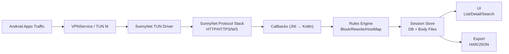

# Android 抓包软件（SunnyNet + VPN TUN）MVP 需求确认

## 背景与目标

我们需要在 Android 上实现一款 **非 Root** 抓包软件，面向研发/测试调试场景，提供对移动端网络请求的捕获、分析、（有限）修改与导出能力。

本项目计划基于 SunnyNet 的中间件能力完成协议解析与改写，并通过 Android `VPNService` 建立 TUN 通道进行流量接入。

- 参考：SunnyNet 项目说明（HTTP/HTTPS/WS/WSS/TCP/UDP、Tun(VPN) Android 驱动）见 `https://github.com/qtgolang/SunnyNet`

## 技术栈与兼容性约束（MVP）

- **最低支持版本**：Android **8.0**（API 26）
- **接入方式**：SunnyNet 通过 **JNI `.so` 同进程直连**，Android 使用 `VPNService` 提供 TUN 通道
- **UI/数据栈**：Kotlin + Compose + Coroutines/Flow + Room + 文件落盘（Body 分离）

详见：`doc/TECH_STACK.md`

## 范围（MVP）

### In-Scope（必须）
- **非 Root 抓包**：使用 `VPNService` 捕获设备流量（可按应用选择）。
- **协议支持**：HTTP / HTTPS（尽可能明文）/ WebSocket（WS/WSS）。
- **会话展示**：实时列表 + 详情页（请求/响应/耗时/大小/应用来源）。
- **过滤与搜索**：按 Host、URL 前缀、方法、状态码、App、时间范围；关键字检索（至少 URL + Header）。
- **HTTPS 解密能力**：
  - 生成/导入 CA（P12 或 PEM），引导用户安装 **用户级 CA 证书**。
  - 标记“不可解密（疑似 pinning/不信任/协议不支持）”的会话并给出原因提示。
- **规则（轻量）**：
  - Block：按 Host/URL 前缀/方法/应用拦截
  - Rewrite Header：增删改指定 Header
  - Host Map：域名映射到指定 `ip:port`
  - Body Replace（可选，MVP 可做轻量版）：仅对 `text/*`、`application/json` 做简单替换
- **导出**：HAR（优先）+ 自定义 JSON（兜底）；支持导出时脱敏。
- **数据治理**：默认脱敏、存储上限、清空数据、一键停止抓包。

### Out-of-Scope（MVP 明确不做）
- Root/内核级抓包方案（iptables、Xposed 等）。
- 完整 QUIC/HTTP3 明文解析与解密（MVP 仅识别/提示，或按 UDP 统计）。
- 断点/交互式请求编辑器（Breakpoints）、请求重放（Replay）（建议 V2）。
- 团队协作/远程同步/云端共享。

## 核心数据流（逻辑视图）

## 角色与使用场景

- **研发/测试**：定位 API 请求失败、对比请求差异、查看 Headers/Cookies、验证重定向与代理链路。
- **安全/协议分析（受限）**：仅在获得授权的测试环境下进行流量分析与改写。

## 功能需求（FR）

### FR-01 抓包启停
- App 内一键开启/关闭抓包。
- 抓包运行时展示前台通知（Android 后台限制合规）。
- 异常退出/权限撤销时，提示原因并可重新开启。

### FR-02 按应用抓包
- 支持选择：
  - **仅抓选中的 App**
  - **排除选中的 App**
- 需要在 UI 中展示应用列表（含搜索），并持久化选择结果。

### FR-03 会话列表
列表项至少包含：
- 时间、App 名称/包名（尽可能）、Host、方法、Path（或 URL 摘要）
- HTTP 状态码（若可解析）、耗时、上下行大小（尽可能）
- 标记：HTTPS 是否解密成功、是否命中规则（Block/Rewrite/HostMap）

### FR-04 会话详情
- **Request**
  - URL（含 Query）
  - Headers（可复制）
  - Body：文本预览、JSON 结构化预览（可选）、二进制仅展示摘要（长度/十六进制前 N 字节）
- **Response**
  - Status / Headers
  - Body：同 Request
- **网络信息**
  - 远端 IP:Port（尽可能）
  - 协议版本（HTTP/1.1、HTTP/2 尽可能识别）

### FR-05 过滤与搜索
- 过滤项：Host、方法、状态码区间、App、时间范围、是否解密成功。
- 搜索：关键字（至少 URL + Header），支持大小写不敏感。

### FR-06 HTTPS 解密（证书）
- 提供“证书管理”页面：
  - 生成 CA（或导入 P12/PEM），展示证书指纹（SHA-256）
  - 引导安装用户证书（并提示 Android 版本差异与风险）
  - 检测证书是否可用（尽可能）
- 对不可解密会话：
  - 标记原因：疑似 pinning / 用户证书不被信任 / 强制 TCP 模式 / 协议不支持等（以实际可判断信息为准）

### FR-07 规则（轻量）
- 规则管理页：新增/编辑/启用/禁用/删除；支持优先级（priority）。
- 匹配维度（MVP 最小集合）：Host、URL 前缀、方法、应用（可选）。
- 动作：
  - Block：直接断开/返回错误（具体实现策略以 SunnyNet 能力为准）
  - Rewrite Header：增删改
  - Host Map：将目标域名转发到指定 `ip:port`
  - Body Replace（可选）：仅文本类 body
- 规则命中结果需在会话中可见（命中哪条规则、执行了什么动作）。

### FR-08 导出
- 导出格式：
  - HAR（优先）
  - 自定义 JSON（兜底）
- 导出范围：单条、筛选结果、多选导出。
- 导出前选项：
  - **脱敏（默认开启）**
  - 是否包含 Body（默认开启，超大 Body 可能截断并标注）

### FR-09 数据管理
- 会话保存策略：
  - 默认保存最近 N 条或最近 M MB（可配置）
  - 超限滚动清理（LRU/按时间）
- 支持“一键清空所有抓包数据”。

## 非功能需求（NFR）

### NFR-Security（安全）
- **默认脱敏**：入库/导出前对以下字段打码（不区分大小写）：
  - `Authorization`
  - `Cookie`
  - `Set-Cookie`
  - Header 名包含：`token`、`secret`、`apikey`、`session`
- **最小权限原则**：仅申请必要权限；VPN 权限提示明确用途。
- **敏感提示**：开启 HTTPS 解密时必须展示风险告知并要求用户确认。

### NFR-Performance（性能）
- 事件处理采用队列与批量落盘：
  - JNI 回调线程只做轻量封装，避免阻塞网络转发路径
  - DB 写入批处理（batch）+ 背压（队列满降采样/丢弃低优先级事件）
- 大响应体策略：
  - DB 仅存元数据 + 预览（前 N KB）
  - 全量 body 落文件（按需加载），可配置最大单条保存上限

### NFR-Stability（稳定性）
- 连续运行 30 分钟不崩溃、不 OOM（以中等强度流量为基准）。
- VPN 被系统回收/用户撤销授权/网络切换时，状态与提示准确。
- 对 native 异常（SIGSEGV 等）有兜底策略（至少启动后检测上次异常并提示）。

### NFR-Compatibility（兼容性）
- Android 版本建议：Android 8.0+（最终最低版本以目标用户群确定）。
- 对 HTTP/2：尽可能解析；不可解析时至少保留连接与统计信息。
- 对 QUIC/HTTP3（UDP）：MVP 不做明文解析，提供识别提示或统计视图。

## 验收标准（Acceptance Criteria）
- AC-01：可在 Android 上 **非 Root** 成功开启/关闭抓包，并能显示 HTTP/HTTPS/WS 会话。
- AC-02：安装 CA 后，对未启用 pinning 的 App 能看到 HTTPS 明文；对 pinning 场景会话标记清晰。
- AC-03：规则 Block / Rewrite Header / Host Map 至少各有 1 个可验证用例通过。
- AC-04：导出 HAR 在桌面工具中可打开；默认脱敏生效（敏感字段不可明文泄露）。
- AC-05：存储上限与清空功能可用；长时间运行不明显卡顿。

## 风险与约束（已知）
- **证书锁定（pinning）**：无法通过普通用户 CA 完全解决，MVP 仅做提示与标记。
- **Android 对用户证书信任差异**：不同版本/厂商 ROM 行为差异，需要在文档/引导中明确说明。
- **JNI 回调频率**：高频事件需要背压与批处理，否则 UI/存储会成为瓶颈。

## 版本规划（建议）
- MVP：本文档所列 In-Scope 功能。
- V2（候选）：断点/重放、脚本化规则、TCP/UDP 深度解析、独立进程隔离、团队协作。

