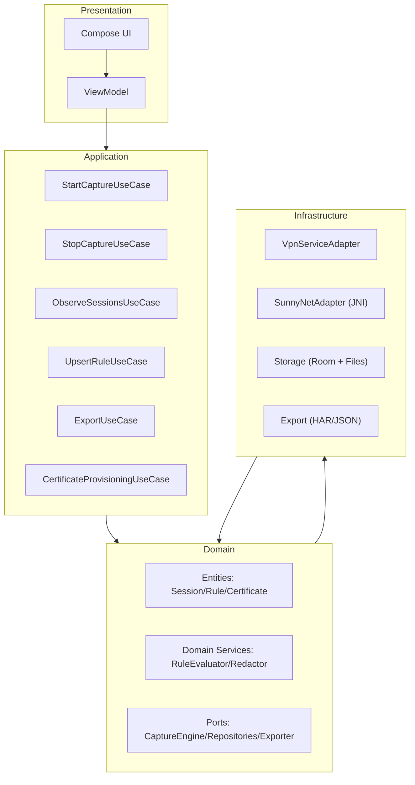
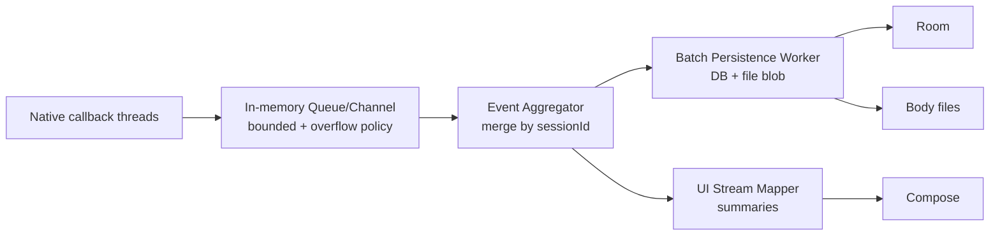
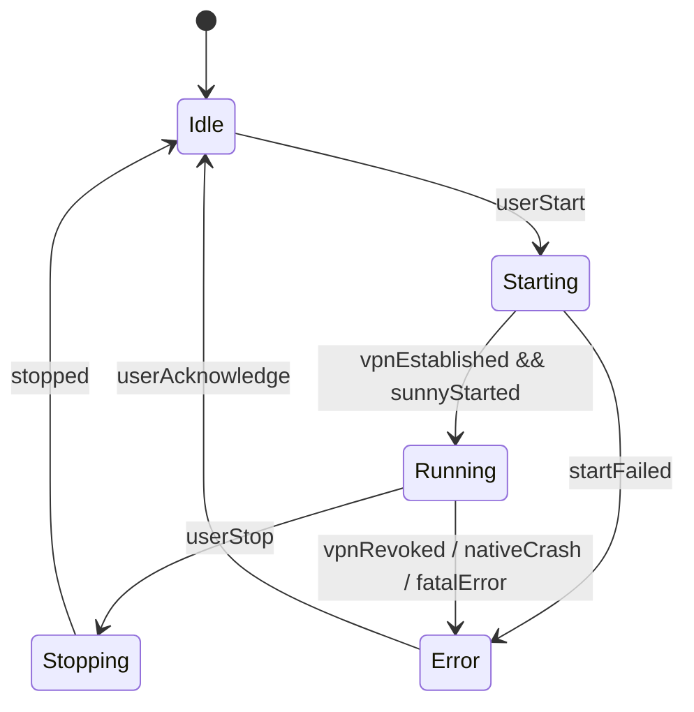

# 架构设计（Android 抓包软件 MVP）

## 架构目标

- **可演进**：MVP 先交付抓包/查看/规则/导出，后续可扩展断点/重放/脚本化/独立进程隔离。
- **可维护**：核心业务以 Clean Architecture + DDD 的边界组织，避免 JNI/VPN/存储细节污染业务。
- **高性能**：抓包链路不被 UI/DB 阻塞，支持背压、批处理与大包落盘。
- **安全合规**：默认脱敏、证书风险提示、最小权限、可清空数据。

## 分层与模块（Clean Architecture）

## 关键组件职责（DDD 视角）

- **Session（聚合根）**
  - **责任**：承载一次“可视化网络会话”的完整信息（请求/响应、元数据、标记、规则命中结果）。
  - **一致性边界**：同一 `sessionId` 下的更新需要顺序一致（事件到达可乱序，但入库需按阶段合并）。
- **Rule（领域对象）**
  - **责任**：表达匹配条件与动作；不直接依赖 SunnyNet/JNI。
- **CaptureEngine（端口）**
  - **责任**：产出事件流（HTTP/WS/...），并接受“动作决策”（如 Block/Rewrite/HostMap）。

## 线程模型与背压（性能关键）

抓包是高频 IO，必须将“转发链路”与“持久化/UI”解耦。

### 背压策略（MVP 必须具备）
- **Queue 有界**：避免 JNI 回调无限堆积导致 OOM。
- **Overflow 策略**（默认）：
  - 优先保留：会话元数据、状态变化、首包/尾包
  - 可丢弃：大 body 分片、重复的进度类事件
- **批处理落盘**：按时间窗（例如 50–200ms）或条数阈值聚合写入，显著降低 DB 压力。

## 状态机（VPN 抓包生命周期）

## 数据建模（存储策略）

### 元数据 vs Body 分离
- **Session 表**：存摘要与索引字段（Host、Method、Status、Timing、Flags、RuleHit）。
- **Body 文件**：大 body 按会话保存到文件，DB 只存 `bodyRef`（路径/偏移/截断信息）。

### 默认脱敏
在 **入库前** 对敏感头与敏感字段进行脱敏，避免日志/导出/崩溃转储泄漏。

## Pros vs. Cons（当前设计取舍）

### Pros
- **边界清晰**：JNI/VPN/DB 可替换，业务用例与领域模型稳定。
- **性能可控**：背压 + 批处理 + body 分离，适配移动端资源限制。
- **可演进**：V2 可平滑加入断点/重放/脚本与独立进程隔离。

### Cons
- **初期工程量更大**：多模块与端口抽象带来一定样板代码。
- **事件一致性处理复杂**：需聚合合并不同阶段事件（SendRequest / ResponseOK / Fail）。

