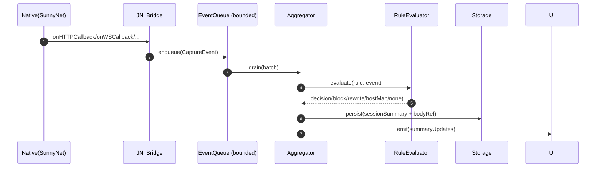
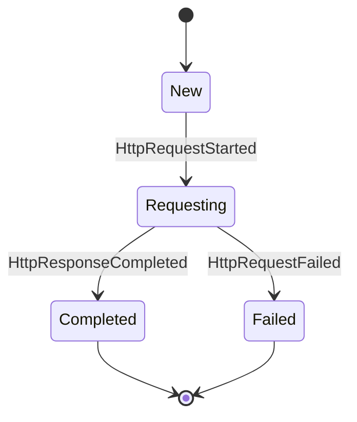

# 事件协议（SunnyNet 回调 → 领域事件 → 会话聚合）

## 目标

- 将 SunnyNet（JNI/Native）产生的回调事件，标准化为 **领域事件（Domain Events）**。
- 在应用层做 **会话聚合（Session Aggregation）**：把同一会话的不同阶段事件合并成可查询的 `SessionDetail`。
- 保证高吞吐：支持背压、批处理与大 Body 分离落盘。

> SunnyNet 支持 HTTP/HTTPS/WS/TCP/UDP 回调，并在 Go 示例中以 `ConnHTTP.Type()`（如 `HttpSendRequest`、`HttpResponseOK`、`HttpRequestFail`）区分阶段。详见：`https://github.com/qtgolang/SunnyNet/blob/main/README_go.md`

## 事件流总览

## 领域事件模型（建议）

### CaptureEvent（顶层）
- 公共字段：
  - `eventId`：单调递增或随机 UUID（用于调试与去重）
  - `timestampMs`
  - `appId`（包名为主，若只能拿到进程名则记录为 `processName`）
  - `transport`：`HTTP` / `WS` / `TCP` / `UDP`
  - `sessionKey`：用于聚合的键（至少包含 `theology/messageId` 等 native 唯一标识 + app 维度）

### HTTP 事件（阶段）
将 SunnyNet 的类型映射为 3 类阶段事件（MVP 需要即可）：
- `HttpRequestStarted`
  - method, url, scheme, host, path, query, requestHeaders
  - requestBodyRef（可选：有 body 则落盘引用）
- `HttpResponseCompleted`
  - statusCode, statusText, responseHeaders, responseBodyRef
  - protocol（HTTP/1.1, HTTP/2 尽可能）
  - serverAddress（ip:port，尽可能）
  - timing（dns/connect/tls/ttfb/download：能取到多少填多少）
- `HttpRequestFailed`
  - errorMessage, failureStage（可选）

> 注意：阶段事件不保证顺序到达（设备/线程/实现差异），聚合器需要可重入合并。

### WebSocket 事件
常见事件：
- `WsConnected`（url, headers?）
- `WsClientSent`（messageType, bodyRef）
- `WsServerSent`（messageType, bodyRef）
- `WsDisconnected`（reason?）

## 会话聚合规则（Aggregator）

### 合并策略（关键）
- **幂等**：同阶段重复事件只更新“更完整/更新鲜”的字段（如更大的 header 集、更晚的 timing）。
- **Body 分离**：body 先写文件（或环形缓冲），DB 只写 `bodyRef` + 预览摘要。
- **标记字段**：
  - `tlsDecrypted`：HTTPS 是否已明文化（无法解密时为 false）
  - `pinningSuspected`：基于特征推断（例如握手成功但无明文、或错误信息提示）
  - `ruleHit`：命中规则 ID 与动作摘要

## 规则评估点（MVP）

### 评估时机
- **HttpRequestStarted**：最适合做 `Block/HostMap/RewriteHeader/RewriteUrl`
- **HttpResponseCompleted**：可做响应 Header/Body 的轻量改写（MVP 可选）
- **WS**：`ClientSent/ServerSent` 可做 body 修改或拦截（MVP 先只做记录）

### 决策输出（Decision）
- `Allow`
- `Block`（直接断开/返回错误：以 SunnyNet 可用能力实现）
- `RewriteHeaders`
- `HostMap(ip:port)`
- `ReplaceBody`（仅文本类）

## 背压与数据截断（必须）

- Queue 容量建议：按设备内存与目标 QPS 配置（例如 2k–10k 事件）
- Overflow 策略建议：
  - 先丢 `bodyChunk` 类事件
  - 再丢重复的 `progress` 类事件
  - 最后才丢 `request/response meta`
- 大 body 截断策略：
  - 默认保存前 `N KB` 预览（如 64KB）
  - 全量保存上限 `M MB`（如 5MB），超过则标注 `truncated=true`

## Pros vs. Cons（事件协议设计）

### Pros
- 领域事件稳定，SunnyNet/JNI 变化影响面小
- 聚合与存储解耦，性能可控
- 方便后续加入 Replay/Breakpoint（以事件为基础）

### Cons
- 聚合器需要处理乱序与缺失事件，逻辑复杂
- 需要严格的背压策略，否则高频回调会击穿 UI/DB

