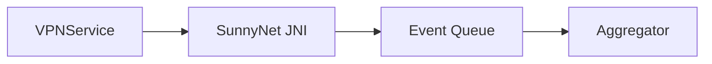
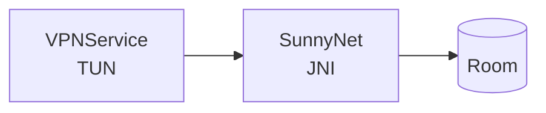

# Mermaid 图表风格与兼容性规范（必须遵守）

由于当前 Markdown/Mermaid 渲染环境存在兼容性差异，本项目统一采用“最保守可渲染”的写法。

## 必须遵守

- 节点文本 **禁止** 使用 `\n`
- 节点文本 **禁止** 使用 ` `
- 节点文本 **必须** 使用 `["..."]` 或 `[text]` 的简单形式
- 尽量避免复杂形状（如 `[(...)]`、`{{...}}`）以及容易触发解析器 bug 的字符组合
- 若出现解析错误，优先：
  - 去掉括号与特殊符号
  - 改为更短的节点文本
  - 拆分为多张小图

## 示例

### 推荐

### 不推荐

