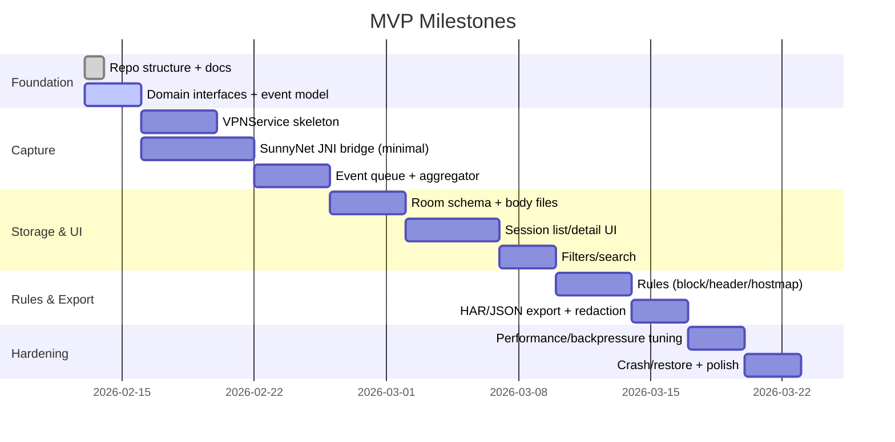

# MVP 实施计划（Android 抓包软件）

## 里程碑

> 注：日期为示意，实际排期以人力与目标发布日期调整。

## 工作分解（按验收标准映射）

### AC-01 非 Root 抓包 + 会话展示
- VPNService 建立 TUN，控制启停与前台通知
- SunnyNet TUN Driver 接入，能收到 HTTP/HTTPS/WS 的基础回调
- 事件入队 → 聚合 → 存储 → UI 列表

### AC-02 HTTPS 明文与 pinning 提示
- CA 生成/导入与安装引导
- 解密成功标记（tlsDecrypted）
- 解密失败分类与 UI 提示（pinningSuspected / untrusted / unsupported）

### AC-03 规则生效
- RuleRepository（持久化）
- RuleEvaluator（匹配与优先级）
- 在请求开始阶段下发动作（Block/RewriteHeader/HostMap）

### AC-04 导出与脱敏
- RedactionPolicy（入库与导出共用）
- HAR 导出（含会话、时间、request/response）
- 自定义 JSON 兜底导出

### AC-05 稳定性与数据治理
- 背压（有界队列、overflow）
- 大 body 截断与按需加载
- 存储上限与滚动清理

## 风险清单与对策

- **证书锁定（pinning）**：
  - 对策：MVP 只提示不可解密原因；不承诺“全量解密所有 App”。
- **高频 JNI 回调导致 UI/DB 被击穿**：
  - 对策：队列有界 + 批处理落盘 + 丢弃策略；UI 使用摘要流（避免全量明细订阅）。
- **Android 后台限制**：
  - 对策：前台服务通知常驻；明确电量与隐私提示。
- **协议覆盖差异（HTTP/2、WebView、厂商 ROM）**：
  - 对策：以“尽可能解析”为目标，提供降级显示与统计。

## Definition of Done（MVP）
- 满足 `doc/ANDROID_MVP_REQUIREMENTS.md` 中所有 AC 条目
- 关键路径（抓包启停、会话列表、导出）有基础自动化测试或可复现手工用例
- 无明显内存泄漏与 ANR（以 30 分钟中等强度流量为基准）

