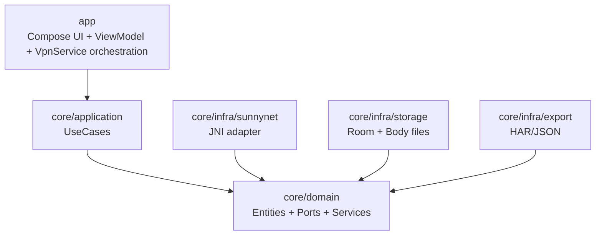

# 技术栈选择（Android 抓包软件 MVP）

## 结论（已确认）

- **最低支持版本**：Android **8.0**（API 26 / `minSdk=26`）
- **Android 语言**：Kotlin（100% Kotlin）
- **UI**：Jetpack Compose + Material 3
- **并发/数据流**：Kotlin Coroutines + Flow
- **架构**：Clean Architecture（domain / application / infra / app 多模块）
- **依赖注入**：Hilt
- **本地存储**：Room（SQLite）+ 文件存储（Body 分离落盘）
- **序列化/导出**：kotlinx.serialization（JSON）+ HAR（JSON 输出）
- **日志**：Timber（Release 可切换 no-op）
- **抓包核心**：SunnyNet（Android 走 Tun(VPN) 驱动）
- **接入方式（MVP）**：JNI `.so` **同进程直连**（事件回调 → 有界队列 → 聚合 → 存储/UI）

参考：SunnyNet 项目说明与能力范围见 `https://github.com/qtgolang/SunnyNet`

## 模块划分（与架构一致）

## 选择理由（面向 NFR）

### Security（安全）
- **默认脱敏**：在入库与导出前统一经过 `Redactor`（避免日志/导出/崩溃转储泄露）。
- **VPN 与证书风险提示**：Compose UI 便于做强提示与分步引导。

### Performance（性能）
- **Coroutines + Flow**：天然适配事件流（抓包回调→聚合→DB→UI）。
- **Room + 索引**：本地检索/筛选更稳；body 分离避免大字段拖慢查询。
- **JNI 同进程**：减少 IPC 开销，降低延迟（MVP 追求可跑通与体验）。

### Scalability（可扩展）
- **Clean Architecture**：SunnyNet/JNI/VPN/DB 都是可替换的基础设施实现。
- 后续可演进到：
  - 独立进程（`:capture`）+ IPC 隔离 native 崩溃
  - 更复杂规则（脚本化/断点/重放）

## Pros vs. Cons（关键取舍）

### Compose + Flow + Room + Hilt
- **Pros**
  - 开发效率高：列表/详情/筛选/搜索迭代快
  - 数据流清晰：事件→聚合→存储→UI 同一范式
  - 工程化成熟：Room/Hilt/Compose 生态完善
- **Cons**
  - Compose 对团队熟练度有要求（但对工具类 App 通常收益更大）

### JNI 同进程直连（MVP）
- **Pros**
  - 实现路径最短，延迟低
  - 便于快速验证 Tun(VPN) 驱动与回调链路
- **Cons**
  - native 崩溃会带崩 App（后续可用独立进程隔离）
  - 回调高频需严格背压（有界队列 + 批处理落盘）

## 备选与触发条件（何时更换）

- **UI 改 XML**：团队对 Compose 不熟 / 需要复用大量旧 UI
- **存储改 SQLDelight**：需要更强 SQL 控制或可复用 SQL 层能力
- **隔离改独立进程 + IPC（V2）**：生产稳定性优先，需隔离 native 崩溃与高负载

