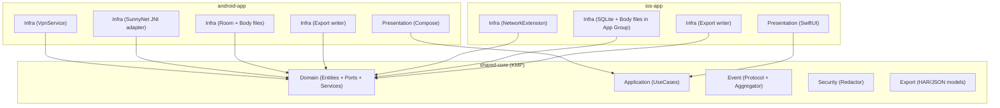

# 技术栈选择（Android + iOS 抓包软件 MVP）

## 结论（已确认）

- **平台**：Android + iOS
- **最低支持版本**
  - Android：**8.0**（API 26 / `minSdk=26`）
  - iOS：**15.0**
- **共享核心（Shared Core）**：Kotlin Multiplatform（KMP）
  - 共享范围：`domain/application/event/aggregator/redactor/export-models`
  - 决策依据：`doc/adr/ADR-0003-shared-core-kmp.md`
- **架构**：Clean Architecture（Domain / Application / Infrastructure / Presentation）
  - Shared Core 只暴露 Ports；平台侧实现 Infra 与 UI
  - 决策依据：`doc/ARCHITECTURE.md`

### Android（MVP）
- **语言**：Kotlin（100% Kotlin）
- **UI**：Jetpack Compose + Material 3
- **并发/数据流**：Kotlin Coroutines + Flow
- **依赖注入**：Hilt（仅 Android 层）
- **本地存储**：Room（SQLite）+ 文件存储（Body 分离落盘）
- **序列化/导出**：kotlinx.serialization（JSON）+ HAR（JSON 输出）
- **日志**：Timber（Release 可切换 no-op）
- **抓包核心**：SunnyNet（Android 走 Tun(VPN) 驱动）
- **接入方式（MVP）**：JNI `.so` 同进程直连（事件回调 → 有界队列 → 聚合 → 存储/UI）

### iOS（MVP）
- **语言**：Swift
- **UI**：SwiftUI
- **并发/数据流**：Swift Concurrency（`async/await`）+（可选）Combine
- **抓包方式**：NetworkExtension + `NEPacketTunnelProvider`（Packet Tunnel Extension）
  - 决策依据：`doc/adr/ADR-0002-ios-platform-strategy.md`
- **数据共享**：App Group（Extension 写入，主 App 查询/展示/导出）
- **本地存储**：SQLite + 文件存储（Body 分离落盘）
  - 建议库：GRDB（工程初始化时落地；如需替换需新增 ADR）
- **日志**：Unified Logging（`os_log`）

参考：SunnyNet 项目说明与能力范围见 `https://github.com/qtgolang/SunnyNet`

## 模块划分（与架构一致）

## 选择理由（面向 NFR）

### Security（安全）
- **默认脱敏**：在入库与导出前统一经过 `Redactor`（避免日志/导出/崩溃转储泄露）。
- **风险提示**：VPN 与 HTTPS 解密都必须做强提示与分步引导；不承诺“解密所有 App”（pinning 例外）。

### Performance（性能）
- **背压与批处理**：JNI 回调线程 / iOS Extension 回调链路不做重活，事件进入有界队列，后台批处理落盘。
- **索引优先 + Body 分离**：DB 仅存索引与摘要，Body 走文件，避免查询与 UI 被大字段拖慢。

### Scalability（可扩展）
- **Shared Core 稳定演进**：事件协议、聚合、脱敏、导出模型统一；平台 Infra 可替换。
- 后续可演进到：
  - Android 独立进程（`:capture`）+ IPC 隔离 native 崩溃
  - 更复杂规则（脚本化/断点/重放）
  - iOS per-app VPN 能力评估（若目标分发场景支持）

## Pros vs. Cons（关键取舍）

### KMP Shared Core（Domain/Application/Event/Redactor/Export）
- **Pros**
  - 双端一致：事件协议、聚合、脱敏与导出模型统一
  - 可测试：核心逻辑可做单元测试，减少平台差异缺陷
- **Cons**
  - 构建与集成复杂：需要 KMP 工程化与 iOS 集成
  - 团队需要掌握 KMP 与 Swift 调用边界

### Android：Compose + Flow + Room + Hilt
- **Pros**
  - 开发效率高：列表/详情/筛选/搜索迭代快
  - 数据流清晰：事件→聚合→存储→UI 同一范式
  - 工程化成熟：Room/Hilt/Compose 生态完善
- **Cons**
  - Compose/Flow/Room 需要团队熟练度；Room schema 变更需管理迁移

### Android：JNI 同进程直连（MVP）
- **Pros**
  - 实现路径最短，延迟低
  - 便于快速验证 Tun(VPN) 驱动与回调链路
- **Cons**
  - native 崩溃会带崩 App（后续可用独立进程隔离）
  - 回调高频需严格背压（有界队列 + 批处理落盘）

### iOS：NetworkExtension Packet Tunnel（MVP）
- **Pros**
  - 符合平台能力边界：系统级流量接入的官方路径
  - 适合长期演进（证书、规则、导出、持久化）
- **Cons**
  - Entitlement/审核存在不确定性，需要尽早验证
  - Extension 生命周期与资源更受限，工程复杂度更高

## 备选与触发条件（何时更换）

- **共享层改 Rust/C++**：若 KMP 集成成本过高或需要更底层的跨平台性能治理（需新增 ADR）
- **存储改 SQLDelight**：需要更强 SQL 控制或更高跨平台复用（需新增 ADR）
- **Android 隔离改独立进程 + IPC（V2）**：生产稳定性优先，需隔离 native 崩溃与高负载

