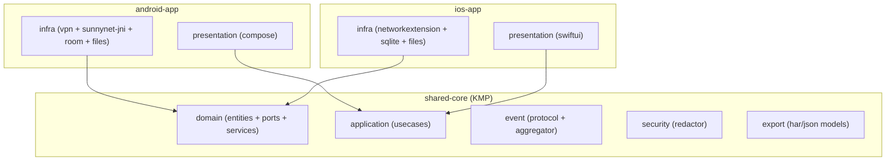

# ADR-0003：共享核心（Kotlin Multiplatform）与模块边界

- **状态**：Accepted
- **日期**：2026-02-14
- **上下文**：
  - 双平台策略：`doc/adr/ADR-0002-ios-platform-strategy.md`
  - Android 现有架构与事件协议：`doc/ARCHITECTURE.md`、`doc/EVENT_PROTOCOL.md`
  - Android 技术栈：`doc/TECH_STACK.md`

## 背景

抓包产品的“业务核心”主要由以下部分组成，并且跨平台高度一致：

- 领域模型：Session/Rule/Certificate 等实体与值对象
- 事件协议：CaptureEvent 的字段语义与类型映射
- 会话聚合：乱序容忍、幂等合并、会话状态机
- 安全默认值：`Redactor` 脱敏策略与导出脱敏
- 导出模型：HAR/JSON 的结构与兼容性扩展

与此同时，平台相关部分强烈依赖系统能力，难以共享：

- Android：`VpnService`、JNI、Room、通知、前台服务
- iOS：`NetworkExtension` Extension、App Group、签名与 Entitlement、iOS 存储实现

因此需要明确：哪些代码共享、共享采用何种技术、模块边界如何落地。

## 决策

### 决策 1：采用 Kotlin Multiplatform（KMP）共享“业务核心”

共享范围定义为：
- `Domain`（Entities + Ports + Domain Services）
- `Application`（UseCases orchestration）
- `Event Protocol`（事件类型与字段语义、聚合器）
- `Redactor`（默认脱敏策略）
- `Export models`（HAR/JSON 的中立数据结构与序列化）

不共享范围（保持平台实现）：
- CaptureEngine 的具体实现（Android: SunnyNet/JNI/VPN；iOS: NetworkExtension）
- 存储实现（Android: Room + Files；iOS: SQLite + Files）
- UI（Android: Compose；iOS: SwiftUI）
- 证书安装引导与系统交互

### 决策 2：共享核心只暴露 Ports，不暴露平台细节

KMP Shared Core 只定义端口接口（Ports），由平台侧 Infra 实现并注入：
- `CaptureEnginePort`
- `SessionRepositoryPort`
- `RuleRepositoryPort`
- `ExporterPort`
- `BodyStorePort`
- `ClockPort`（便于测试与一致性）

> 原则：Shared Core 不依赖 Android SDK / iOS SDK / JNI / Room / NetworkExtension。

## 目标架构（模块视图）

## Pros vs. Cons

### Pros
- **一致性更强**：事件协议、聚合与脱敏是同一套逻辑，减少双端差异与缺陷
- **可测试性更好**：Shared Core 可做纯 JVM/Native 单元测试，聚合器与脱敏更容易覆盖边界用例
- **符合既有边界**：与你们 `doc/ARCHITECTURE.md` 的 Clean Architecture/Ports 思路一致

### Cons
- **工程与构建复杂度上升**：需要配置 KMP、产物导出、iOS 集成与调试链路
- **团队学习成本**：需要掌握 KMP 的依赖管理与 iOS 侧调用模式
- **并发模型适配**：Shared Core 使用 Kotlin 协程时，需要谨慎暴露给 Swift（建议边界用 callback/async wrapper）

## 影响范围（需要同步）

- `doc/TECH_STACK.md` 需要新增：
  - KMP shared-core
  - iOS 技术栈（Swift/SwiftUI/NetworkExtension/App Group/SQLite）
- `doc/MVP_IMPLEMENTATION_PLAN.md` 需要调整里程碑：
  - Shared Core 先于平台 Infra 落地（先定事件协议与端口，再做 Android/iOS 适配）
- 工程结构初始化时需要新增 shared 模块（KMP），并确保平台依赖单向：
  - platform -> shared-core
  - shared-core 不反向依赖 platform

